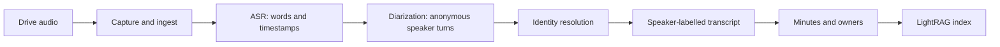

# Speaker labels and attribution

This guide explains exactly how the meeting-minutes pipeline answers two
different questions:

1. **Who was speaking at each moment?**
2. **Which real person does that anonymous speaker represent?**

The first question is called **diarization**. The second is **identity
resolution**. They are separate steps and both are needed before minutes can
reliably assign an action item to a person.

## The short answer

The system does **not** currently learn a permanent voiceprint after one
introduction. Diarization labels such as `SPEAKER_00` are anonymous and can be
assigned differently in every recording. `SPEAKER_00` in today's meeting is not
guaranteed to be the same person as `SPEAKER_00` tomorrow.

When a recording is processed, the resolver combines evidence from that
recording with names seen in earlier meetings. It can reuse a person's spelling
as a suggestion, but it only writes a name when the evidence is good enough. For
reliable recurring attribution, use a meeting-specific override when you know
who a label is.

## End-to-end flow



### 1. Capture and ingest

The computer downloads a completed recording from the private `Easy Voice
Recorder` Drive folder. It records the Drive file ID and revision, verifies the
download, and creates one manifest row. Drive remains the durable original.

### 2. ASR and timestamps

WhisperX turns the audio into words and time ranges. At this point the text is
accurate enough to read, but it does not know who said each word.

### 3. Diarization

The pyannote models listen for changes in voices and divide the transcript into
turns. The result looks like this:

```text
[00:00] SPEAKER_00: Thanks for joining.
[00:04] SPEAKER_01: Happy to be here.
[00:08] SPEAKER_00: Let's review the launch date.
```

These labels describe voice separation only. They are not names and are not a
cross-meeting identity.

Diarization requires all of the following:

- `HF_TOKEN` set in `.env` (loaded by `pipeline/config.py` via `load_dotenv`);
- acceptance of the terms for **`pyannote/speaker-diarization-community-1`** on
  Hugging Face, using the same account that owns the token;
- the ASR extra installed (`uv sync --extra asr`).

**Which model is gated depends on the installed pyannote version.** whisperx
resolves `model_name or "pyannote/speaker-diarization-community-1"`, so
pyannote 4.x needs `speaker-diarization-community-1`. Accepting the older
`speaker-diarization-3.1` and `segmentation-3.0` alone is **not** sufficient
and produces no speaker labels. Accepting all three is harmless and covers a
future downgrade.

To confirm access before trusting a nightly run:

```powershell
uv run python -c "from pipeline.config import HF_TOKEN; from whisperx.diarize import DiarizationPipeline; DiarizationPipeline(token=HF_TOKEN, device='cpu'); print('diarization OK')"
```

A `GatedRepoError: 403` here means the terms were never accepted on that
account. Note that `HfApi().model_info()` succeeds even when the gate is
closed — metadata is public, file downloads are not — so metadata access is
not evidence that diarization will work.

If the token or model access is missing, the pipeline keeps the transcript and
prints a diagnostic, but the stage is still recorded as `ok`. Under the nightly
scheduled task that message goes to a discarded stdout, so the only visible
symptom is `0 speakers` in `pipeline status`.

### 4. Identity resolution

The `speakers` stage resolves anonymous labels using this conservative cascade.
Later evidence wins:

1. **Strict filename hint.** With exactly two detected speakers, a one- or
   two-word filename hint, and `--owner` supplied, the dominant speaker is
   treated as the recorder and the other speaker is treated as the hint. This is
   only a clue; it is not used when the conditions are ambiguous.
2. **Opening transcript.** The resolver sends the first four minutes to the
   configured language model. It looks for introductions and direct references
   such as “Hi, I'm Priya” or “Priya, can you take that?”
3. **Known names.** Names seen in previous meetings are supplied as preferred
   spellings. This helps keep `Michael` and `Mike` from becoming two graph
   entities, but it is not a voice match and it is not proof of identity.
4. **Manual override.** `speaker-overrides.yaml` is ground truth and wins over
   every inference.

The resolver returns `null` rather than guessing. That is intentional: an
unresolved `SPEAKER_01` is visible and correctable; a wrong name silently gives
the wrong person an action item.

### 5. Minutes and indexing

The readable Markdown transcript is rewritten with resolved names. The raw JSON
transcript keeps the original anonymous labels as provenance. Minutes use the
resolved names for attendees, dialogue, decisions, and action-item owners. Any
label still unresolved is written as `Unknown speaker (SPEAKER_01)`.

The minutes—not the raw transcript—are sent to LightRAG for search.

## First-time setup

Do this once before expecting speaker attribution:

1. Create a Hugging Face read token, then — signed in as that same account —
   accept the terms at
   <https://hf.co/pyannote/speaker-diarization-community-1>. Also accept
   `speaker-diarization-3.1` and `segmentation-3.0` to cover older pyannote.
2. Put `HF_TOKEN=hf_...` in `.env`, then run the access check above.
3. Confirm the ASR dependencies are installed:

   ```powershell
   uv sync --extra asr
   ```

4. Process a short test recording through transcription, stopping before
   speaker resolution so you can review the labels:

   ```powershell
   uv run pipeline capture
   uv run pipeline ingest
   uv run pipeline transcribe --limit 1
   ```

5. Open the generated Markdown file in `transcripts/`. Confirm that separate
   voices have separate labels and that names are only attached where justified.
   If you know a label's identity, add a meeting-specific override now. Then run
   the remaining stages:

   ```powershell
   uv run pipeline speakers --owner "Faraz" --limit 1
   uv run pipeline minutes --limit 1
   uv run pipeline index --limit 1
   ```

## Identifying a person manually

The override file is repository-local, ignored by Git, and should be treated as
private meeting metadata. Use a short prefix of the meeting's 64-character ID;
the prefix is visible in the transcript filename and in `pipeline status`.

```yaml
# speaker-overrides.yaml

# Use a meeting-specific block for reliable attribution.
a65aa77a0580:
  SPEAKER_00: Faraz
  SPEAKER_01: Priya

ae9005614041:
  SPEAKER_00: Faraz
  SPEAKER_01: Unknown guest
```

Prefer a meeting-specific block. A `default:` block is supported, but it is
safe only when you have an external reason to know that the label assignment is
stable for your recordings. Diarization itself does not provide that guarantee.

The accepted confidence values are:

- `inferred`: filename or model evidence;
- `confirmed`: an explicit override;
- `unknown`: no safe name was available.

## The process for a new speaker

For every new recording:

1. Let the normal pipeline transcribe and diarize it.
2. Review the first four minutes and the labelled transcript. Look for an
   introduction or a direct name reference.
3. If the identity is clear, add the label to a meeting-specific override.
4. If the identity is not clear, leave the label unresolved. Do not infer it
   from voice similarity, speaking order, or `SPEAKER_00`.
5. Run the speaker stage before minutes are compiled:

   ```powershell
   uv run pipeline speakers --owner "Faraz" --limit 1
   uv run pipeline minutes --limit 1
   uv run pipeline index --limit 1
   ```

6. Confirm the generated minutes show the right attendee and action-item owner.

For a recurring person, use the same spelling each time. The known-name list
helps the model prefer that spelling, but the mapping is still established per
meeting unless you explicitly add an override.

## Correcting an attribution

The raw JSON transcript is the audit record and should not be edited. Update
the override file instead. A correction needs the speaker stage and the
downstream stages to run again so the Markdown transcript, minutes, and index
agree.

The current command-line workflow is designed to apply overrides before a
meeting reaches the `speakers_resolved` stage. For a meeting that is already
indexed, do not edit the SQLite database by hand. Leave the raw label intact and
schedule a controlled speaker re-resolution/recompile before relying on the
corrected owner. This is a deliberate safety boundary in the current version.

## What “one-time identification” would require

A true one-time enrollment would need a speaker registry with voice embeddings
or another privacy-reviewed voice-recognition system. That would store a voice
profile for each person and match future recordings against it. The current
pipeline intentionally does not store voiceprints; it uses transcript evidence
and explicit overrides instead. This keeps identity decisions reviewable and
avoids silently matching the wrong person.

## Troubleshooting

**There are no `SPEAKER_00` labels.** Diarization did not run, and the stage
still reported `ok`. Run the access check in the Diarization section — a
`GatedRepoError: 403` naming `speaker-diarization-community-1` means the terms
were never accepted on the token's account. This is the most common cause and
it fails silently under the nightly task. Then check the ASR extra and
transcribe again.

**The model named the wrong person.** Add a meeting-specific override. Manual
overrides beat filename hints and model inference.

**A new guest is unknown.** Leave the label unresolved until the recording or a
human review identifies them. Unknown is safer than a false owner.

**The same person appears under two spellings.** Choose one canonical spelling
and use it in future overrides. Correct older minutes through a controlled
re-resolution/recompile; do not alter the raw JSON provenance.

**Check current state.**

```powershell
uv run pipeline status
```

For per-meeting resolved and unresolved labels, run the `speakers` stage; its
output lists mappings and any labels that remain unresolved. `pipeline status`
confirms the meeting's overall stage and the stage timings.
